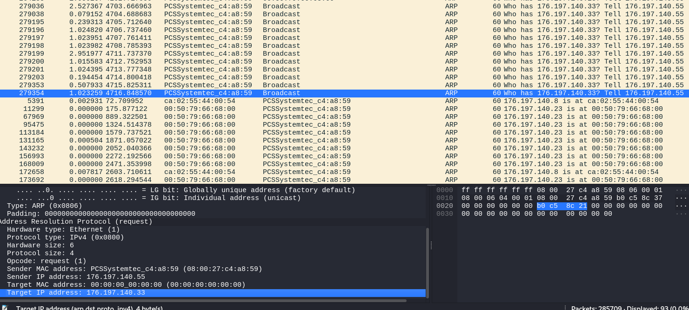
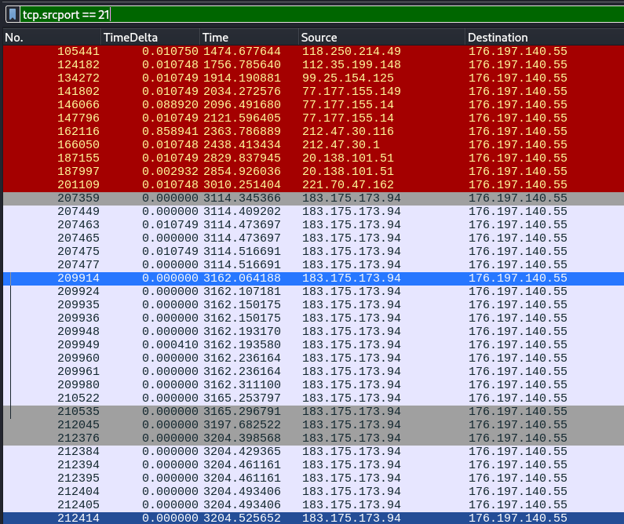
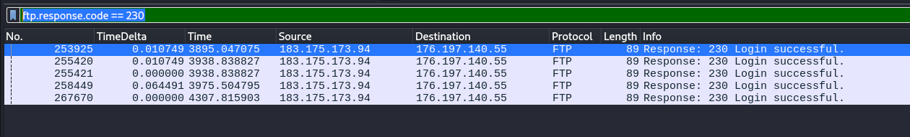
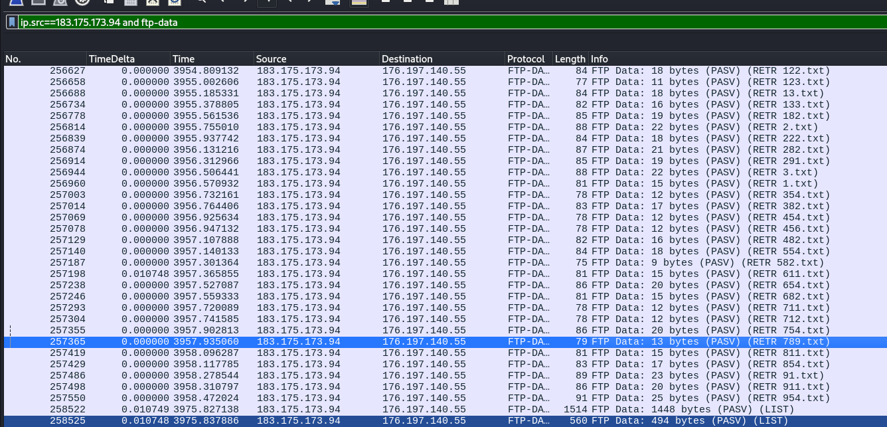
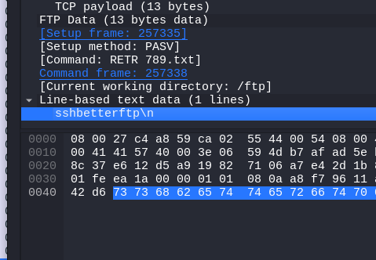
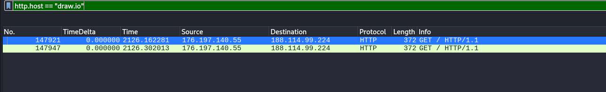
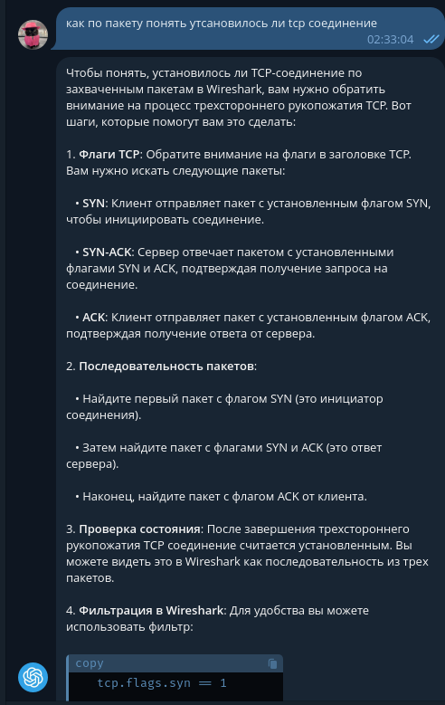
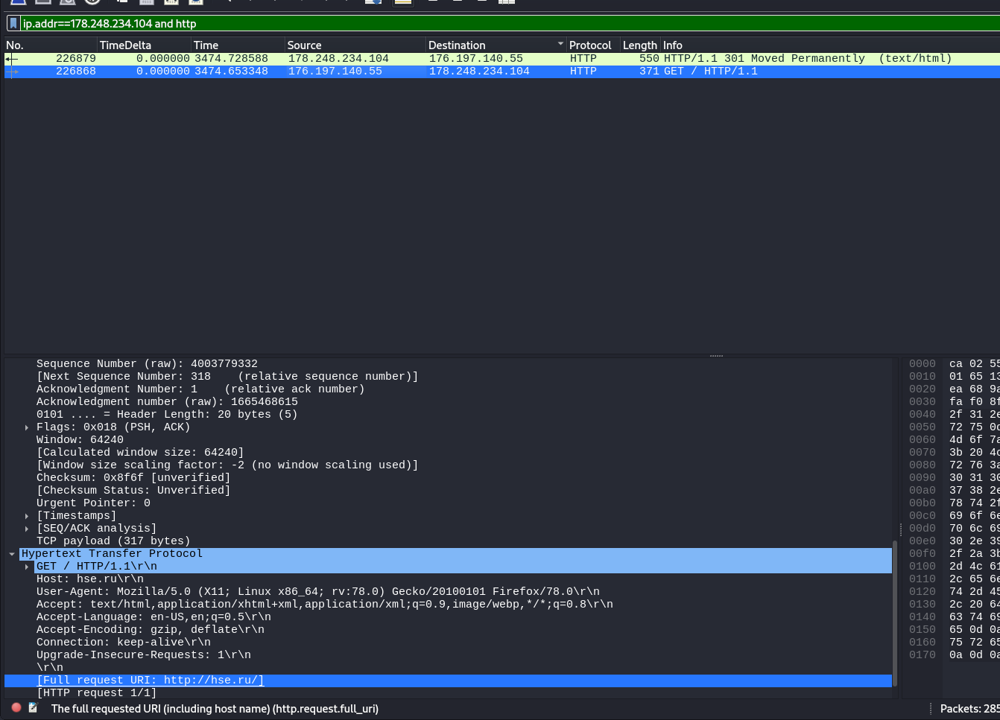

### 1) 

```
ip.dst==176.197.140.55 and ip.dst==176.197.140.55
```


### 2)
```
arp and eth.addr == 08:00:27:c4:a8:59
```

arp запрос на broadcast (широковещательный адрес) через шлюз 176.197.140.33



### 3)
отфильтровал по порту и чекнул самый часто встречающийся и не подчеркнутый красным. Красное видимо что-то плохое. Хз, не успел еще загуглить


### 4-5)
отфильтровал пакеты по ftp.response.code == 230. Получил пятьь штук:

В первом находим нужную нам информацию:


### 6)
Знаем что файлы передаются по протоклу ftp, -> применяем соотевтсующий фильтр и находим файйл

А вот его содержимое:


### 7)
Ищу по фильтру пакет с подключением:

Теперь знаем, что draw.io располагается по адресу 188.114.99.224
Спрашиваем у чата гпт что нам делать:


Делаю фильтр по ip адрессу и видмо получаю ответ


### 8)
Фильтруем по хосту, находим айпишник

### 9)
Ищем http запросы к соотвествующему адресу. Находим в пакете хсе точка ру

### 10)
))